## Architecture Diagram

```mermaid
flowchart TD
  %% Nodes
  google_compute_firewall_allow_http_ssh["google_compute_firewall.allow_http_ssh"]
  google_compute_global_address_private_ip_address["google_compute_global_address.private_ip_address"]
  google_compute_instance_gallery_app["google_compute_instance.gallery_app"]
  google_compute_network_vpc_network["google_compute_network.vpc_network"]
  google_compute_subnetwork_default["google_compute_subnetwork.default"]
  google_project_iam_member_cloudsql_client["google_project_iam_member.cloudsql_client"]
  google_service_account_gallery_app["google_service_account.gallery_app"]
  google_service_networking_connection_private_vpc_connection["google_service_networking_connection.private_vpc_connection"]
  google_sql_database_gallery_db["google_sql_database.gallery_db"]
  google_sql_database_instance_gallery_sql_db["google_sql_database_instance.gallery_sql_db"]
  google_sql_user_gallery_user["google_sql_user.gallery_user"]
  google_storage_bucket_flask_gallery_bucket["google_storage_bucket.flask_gallery_bucket"]
  google_storage_bucket_iam_member_public["google_storage_bucket_iam_member.public"]

  %% Edges
  google_compute_firewall_allow_http_ssh --> google_compute_network_vpc_network
  google_compute_global_address_private_ip_address --> google_compute_network_vpc_network
  google_compute_instance_gallery_app --> google_compute_subnetwork_default
  google_compute_instance_gallery_app --> google_service_account_gallery_app
  google_compute_instance_gallery_app --> google_storage_bucket_flask_gallery_bucket
  google_compute_subnetwork_default --> google_compute_network_vpc_network
  google_project_iam_member_cloudsql_client --> google_service_account_gallery_app
  google_project_iam_member_storage_admin --> google_service_account_gallery_app
  google_service_networking_connection_private_vpc_connection --> google_compute_global_address_private_ip_address
  google_sql_database_gallery_db --> google_sql_database_instance_gallery_sql_db
  google_sql_database_instance_gallery_sql_db --> google_service_networking_connection_private_vpc_connection
  google_sql_user_gallery_user --> google_sql_database_instance_gallery_sql_db
  google_storage_bucket_iam_member_public --> google_storage_bucket_flask_gallery_bucket
```


# Gallery Application Infrastructure

This directory contains Terraform configurations to deploy the Gallery application infrastructure on Google Cloud Platform (GCP).

## Architecture

The infrastructure consists of the following components:

1. **Networking**
   - Custom VPC network (10.0.0.0/16)
   - Subnet in us-central1 region
   - Firewall rules for HTTP/HTTPS traffic

2. **Compute**
   - Compute Engine VM (e2-standard-2)
   - Debian 11 image
   - Service account with least-privilege access

3. **Database**
   - Cloud SQL MySQL instance (2nd gen)
   - Private IP access
   - Automated backups enabled

4. **Storage**
   - Cloud Storage bucket for image storage
   - Uniform bucket-level access enabled

5. **Application**
   - Flask application deployed as systemd service
   - Automatic restart on failure

## Prerequisites

1. Install Terraform (version >= 1.0.0)
2. Install Google Cloud SDK
3. Create a GCP project
4. Enable required APIs:
   - Compute Engine API
   - Cloud SQL Admin API
   - Cloud Storage API
   - Cloud Resource Manager API

## Setup Instructions

1. Create a GCS bucket for Terraform state:
   ```bash
   gsutil mb gs://gallery-app-terraform-state
   ```

2. Create a terraform.tfvars file with your configuration:
   ```hcl
   project_id  = "your-project-id"
   db_username = "your-db-username"
   db_password = "your-db-password"
   ```

3. Initialize Terraform:
   ```bash
   terraform init
   ```

4. Review the planned changes:
   ```bash
   terraform plan
   ```

5. Apply the configuration:
   ```bash
   terraform apply
   ```

## Accessing the Application

After successful deployment, the application will be available at:
- Main application: http://<VM-IP>:80

## Cleanup

To destroy all resources:
```bash
terraform destroy
```

## Security Notes

1. The database is only accessible through private IP
2. Service account has minimal required permissions
3. Sensitive variables are marked as sensitive in Terraform
4. Firewall rules are restricted to necessary ports

## Cost Estimation

Estimated monthly costs:
- Compute Engine (e2-standard-2): ~$50/month
- Cloud SQL (db-n1-standard-1): ~$100/month
- Cloud Storage: Pay per use
- Network: Pay per use

Total estimated cost: $150-200/month (varies based on usage) 
